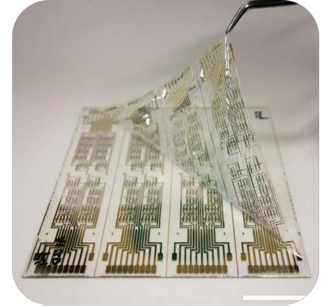
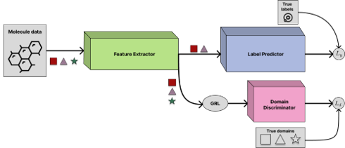
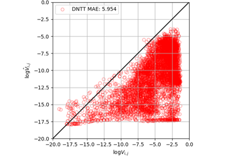
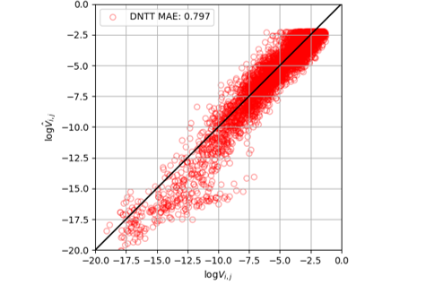

# Domain Adaptation applied to organic semiconductors
This repository contains the work I did during my Master's thesis at the Technical University of Munich (TUM). 

Supervisor: Prof. Dr. rer. nat. habil. Hans-Joachim Bungartz  
Advisor: Kouroudis Ioannis, M.Sc.

<figure>
    
    <figcaption style="font-size: 0.8em;">Organic Semiconductor.</figcaption>
</figure>

## Description 
Simulations aim to accurately reproduce the physics of materials, providing detailed molecular properties. However, they are noted to be computationally expensive. On the other hand, machine learning, can predict molecular properties given a training dataset, offering much faster results than traditional simulations but requiring ground truth data derived from those simulations for training.

Introducing a __transfer learning__ approach in Artificial Intelligence could mitigate the drawbacks of both methods. Transfer learning allows a model developed for one task to be repurposed on a second related task, leveraging the knowledge gained from the first task to improve performance on the second. This method would significantly reduce the need for extensive ground truth data from new simulations since the model would already possess a foundational understanding of molecular properties. Consequently, transfer learning would facilitate faster results without the heavy computational expense typically associated with high-fidelity simulations.

<figure>
    
    <figcaption style="font-size: 0.8em;">Domain Adaptation architecture using adversarial training.</figcaption>
</figure>

In the present study, we have embraced Domain Adaptation (DA) as the chosen method of transfer learning. Employing Graph Neural Networks (GNNs), we demonstrate that by initially training the model on molecular data from pentacene and tetracene, we can accurately predict the charge transfer integral properties of the organic semiconductor DNTT. This approach not only highlights the efficacy of Domain Adaptation in transfer learning but also showcases the potential of GNNs in the field of molecular property prediction.

This research establishes a foundational framework for a broader investigation into the application of Domain Adaptation within Materials Science. By integrating more sophisticated models and employing a diverse dataset, subsequent studies may corroborate the utility of DA as a robust technique for generalized transfer learning across a spectrum of material-based computational studies.

We show that it is possible to apply Domain Adaptation (DA) to study organic semiconductors and we lay the ground for a more in-depth study on the role of transfer learning in Material Science. 

## Results
Below, we present a comparative analysis of the performance between a standard GNN and a GNN enhance by DA techniques (DA GNN). Each network has been subjected to training on datasets comprising pentacene and tetracene samples, with the objective of generalizing their predictive capabilities to the DNTT compound. The results distinctly indicate that the application of the DA algorithm significantly enhances the accuracy of the predictions rendered by the GNN.

<figure>
    
    <figcaption style="font-size: 0.8em; text-align: center;">Results of vanilla GNN.</figcaption>
</figure>
<figure>
    
    <figcaption style="font-size: 0.8em; text-align: center;">Results of DA GNN.</figcaption>
</figure>

